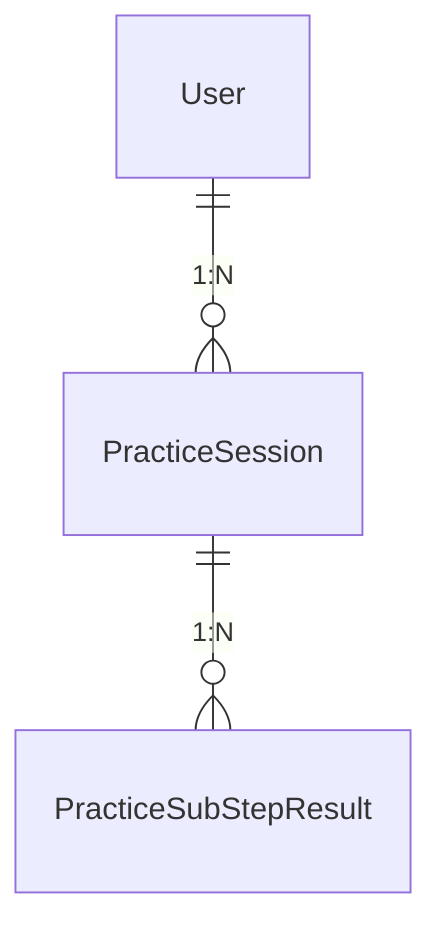

# 연습 탭(Practice Tab) API 명세서 — Spring 담당분

> 이 문서는 TALKI 연습 탭(CBT 기반 6단계 위저드) 신규 기능 중 **이 레포(Spring Boot)가 담당하는 범위**만 다룬다.
> FastAPI 쪽 실제 AI 분석 로직/엔드포인트는 별도 레포에서 명세 중이며, 이 문서에서는 Spring이 FastAPI와 주고받는
> **인터페이스 계약(요청/응답 스키마)만 가정(assumption)** 하여 정의한다. 가정 항목은 본문에 "⚠️ 가정"으로 표기한다.

## 0. 확정된 설계 전제

- **세션 재개 없음**: 위저드 진행 중 이탈하면 해당 세션은 폐기된다. 재접속 시 0단계(인트로)부터 새로 시작한다.
  진행 중 상태는 Redis에만 존재하고, MySQL에는 7단계(완료) 시점에 한 번만 기록된다.
- **4단계(연습 진행) 통신 패턴**: 실전 탭의 `/realtime` WebSocket 중계 패턴을 그대로 재사용한다. 좌표/음성을
  실시간 스트리밍으로 FastAPI에 전달하고, 진행 중 라이브 피드백 + 종료 시 최종 결과를 받는다.
- **배포 구조**: FastAPI는 클라우드에 배포되지 않고 로컬 GPU PC의 Docker Desktop에서 상시 실행되며, SSH
  리버스 터널로 EC2(Spring)와 연결된다. 이 문서의 모든 예시는 `fastapi.url` 등 환경변수로 주소를 분리하며,
  실제 호스트/포트(로컬 IP, 터널 포트)는 절대 하드코딩하지 않는다. 기존 코드(`WebClientConfig`,
  `FastApiWebSocketClient`)와 동일하게 `${fastapi.url}` 프로퍼티를 base로 사용한다.

---

## 1. 연습 탭 전체 플로우 개요 및 담당 범위

```
0 인트로 ─▶ 1 자동사고 인식 ─▶ 2 호흡 조절 ─▶ 3 연습 선택 ─▶ 4 연습 진행 ─▶ 5 행동실험 결과 ─▶ 6 대체사고 추천 ─▶ 7 완료/리포트
   (Spring)      (Spring)        (Spring)      (Spring)      (Spring+FastAPI)   (Spring)          (Spring)         (Spring)
```

| 단계 | 내용 | 데이터 종류 | 담당 |
|---|---|---|---|
| 0 | 인트로, 훈련 시작 | 세션 생성 | Spring 전담 |
| 1 | 부정적 자동사고 인식 (복수선택+직접입력) | 텍스트/선택 | Spring 전담 |
| 2 | 10초 호흡 유도 (완료 여부만) | boolean | Spring 전담 |
| 3 | 연습 모드 선택 (A/B/스킵) | 선택 | Spring 전담 |
| 4 | 연습 진행 (하위단계별 AI 분석) | 음성/좌표 → AI 분석 결과 | **Spring(중계) + FastAPI(분석)** |
| 5 | 행동실험 결과 (기대 vs 실제) | 선택 | Spring 전담 |
| 6 | 대체 사고 추천 (선택+직접입력) | 텍스트/선택 | Spring 전담 |
| 7 | 완료 화면 + 최종 리포트 | 집계 | Spring 전담 |

이 레포는 1~3, 5~7단계의 REST API 전체와, 4단계의 **WebSocket 중계 + 세션 상태 관리**를 담당한다.
4단계 하위단계(스크립트 읽기, 시선 고정, 즉흥 말하기, 키워드 기반 구성, 핵심 파악)의 실제 분석 알고리즘은
FastAPI 레포 담당이며, 여기서는 인터페이스만 정의한다.

### 3단계 모드 ↔ 4단계 하위단계 매핑

| 모드 | 하위단계 순서 | 예상 소요 | 기존 `PracticeType` enum 매핑 |
|---|---|---|---|
| A. 스크립트 기반 기초 연습 | 스크립트 읽기 연습 → 시선 고정 훈련 | 약 8분 | `SCRIPT` → `GAZE` |
| B. 즉흥 구성 연습 | 즉흥 말하기 → 키워드 기반 구성 → 핵심 파악 | 약 10분 | `IMPROMPTU` → `KEYWORD` → `POINT` |
| (3단계 스킵) | 없음, 4단계 건너뜀 | - | - |

> ⚠️ 기존 `enums/PracticeType`에는 `SPEED` 값이 존재하지만 현재 플로우 정의(0~7단계)에는 대응하는
> 하위단계가 없다. 이 문서에서는 `SPEED`를 사용하지 않는 것으로 가정한다. (향후 "말하기 속도 훈련"이
> 별도 하위단계로 추가될 여지를 남겨둔 것으로 보이며, 필요 시 재논의)

---

## 2. Spring이 클라이언트에 제공하는 엔드포인트 목록

Base path: `/practice` (Tag: `Practice`). 인증은 4번 항목 참고.

| # | 단계 | Method | Path | 설명 |
|---|---|---|---|---|
| 1 | 0 | POST | `/practice/sessions` | 연습 세션 시작 (Redis에 세션 생성) |
| 2 | 1 | PATCH | `/practice/sessions/{sessionId}/thought-recognition` | 자동사고 인식 응답 저장 |
| 3 | 2 | PATCH | `/practice/sessions/{sessionId}/breathing` | 호흡 조절 완료 기록 |
| 4 | 3 | PATCH | `/practice/sessions/{sessionId}/mode` | 연습 모드 선택 (or 스킵) |
| 5 | 4 | WS | `/practice/realtime?sessionId={id}&subStep={type}` | 하위단계 실시간 분석 중계 (WebSocket) |
| 6 | 4 | GET | `/practice/sessions/{sessionId}` | 세션 진행 상태 조회 (FE 동기화용) |
| 7 | 5 | PATCH | `/practice/sessions/{sessionId}/behavioral-experiment` | 행동실험 결과 저장 |
| 8 | 6 | PATCH | `/practice/sessions/{sessionId}/alternative-thought` | 대체 사고 저장 |
| 9 | 7 | POST | `/practice/sessions/{sessionId}/complete` | 세션 완료 → MySQL 영구 저장 + 스트릭 갱신 |
| 10 | 7 | GET | `/practice/sessions/{sessionId}/report` | 완료된 세션의 최종 리포트 조회 |

> 기존 `PracticeController`의 `POST /practice/end`(및 `PracticeService.endPracticeAndSave`, `PracticeDTO`)는
> 이 신규 플로우로 대체되어 **폐기 대상**이다. (8번 표, "재사용 vs 신규" 참고)

---

## 3. 엔드포인트별 Request/Response 스키마

공통: 모든 응답은 실전 탭과 동일하게 `ResponseEntity<?>` 또는 순수 DTO 반환 패턴을 따른다. 클라이언트-Spring
간 JSON 필드는 **camelCase**를 사용한다 (실전 탭의 `FeedbackResponseDTO` 등과 동일한 컨벤션).

### 3.1 POST /practice/sessions — 훈련 시작

Request Body: 없음 (인증 토큰만 사용)

Response 200:
```json
{
  "sessionId": "6f1a9d2e-6b7b-4c3a-9c34-5e2b7d6a1a10",
  "currentStep": "THOUGHT_RECOGNITION"
}
```

### 3.2 PATCH /practice/sessions/{sessionId}/thought-recognition — 자동사고 인식

Request:
```json
{
  "selectedThoughts": ["FEAR_OF_JUDGEMENT", "FEAR_OF_BLANKING"],
  "customThought": "중간에 말이 막히면 어떡하지"
}
```
> ⚠️ 가정: `selectedThoughts`는 고정된 항목 pool(enum)에서 복수 선택. pool은 FE/BE 양쪽에 고정값으로
> 공유되는 소규모 목록이라고 가정하고 별도 마스터 테이블/조회 API는 두지 않는다. (예시 값:
> `FEAR_OF_JUDGEMENT`, `FEAR_OF_FAILURE`, `FEAR_OF_BLANKING`, `FEAR_OF_BORING_AUDIENCE`, `PHYSICAL_ANXIETY`, `OTHER`)

Response 200:
```json
{ "currentStep": "BREATHING" }
```

### 3.3 PATCH /practice/sessions/{sessionId}/breathing — 호흡 조절

Request:
```json
{ "completed": true }
```
Response 200:
```json
{ "currentStep": "MODE_SELECTION" }
```

### 3.4 PATCH /practice/sessions/{sessionId}/mode — 연습 모드 선택

Request:
```json
{ "mode": "SCRIPT_BASED" }
```
`mode`: `SCRIPT_BASED` | `IMPROMPTU` | `SKIPPED`

Response 200 (스킵하지 않은 경우):
```json
{
  "currentStep": "PRACTICE_IN_PROGRESS",
  "subStepQueue": ["SCRIPT", "GAZE"]
}
```
Response 200 (스킵한 경우, 4단계를 건너뛰고 바로 5단계로):
```json
{
  "currentStep": "BEHAVIORAL_EXPERIMENT",
  "subStepQueue": []
}
```

### 3.5 WS /practice/realtime?sessionId={id}&subStep={type} — 연습 진행

4번 항목(Spring→FastAPI 인터페이스 계약)에서 상세 기술. Spring은 실전 탭의 `RealtimeWebSocketHandler` /
`FastApiWebSocketClient`와 동일한 구조로, 클라이언트 WS ↔ FastAPI WS 사이를 중계하는 얇은 프록시 역할만
수행한다. 다만 FastAPI가 보내는 최종 결과(`type: "result"`) 메시지는 가로채어 Redis 세션 상태에
`subStepResults`로 누적 저장한 뒤 그대로 클라이언트에도 전달한다.

### 3.6 GET /practice/sessions/{sessionId} — 진행 상태 조회

Response 200:
```json
{
  "currentStep": "PRACTICE_IN_PROGRESS",
  "mode": "SCRIPT_BASED",
  "subStepQueue": ["SCRIPT", "GAZE"],
  "completedSubSteps": ["SCRIPT"]
}
```

### 3.7 PATCH /practice/sessions/{sessionId}/behavioral-experiment — 행동실험 결과

Request:
```json
{ "expectationVsReality": "BETTER_THAN_EXPECTED" }
```
`expectationVsReality` (단일 선택, ⚠️ 가정): `MUCH_WORSE_THAN_EXPECTED` | `WORSE_THAN_EXPECTED` |
`AS_EXPECTED` | `BETTER_THAN_EXPECTED` | `MUCH_BETTER_THAN_EXPECTED`

Response 200:
```json
{ "currentStep": "ALTERNATIVE_THOUGHT" }
```

### 3.8 PATCH /practice/sessions/{sessionId}/alternative-thought — 대체 사고 추천

Request:
```json
{
  "selectedThought": "PRACTICE_MAKES_IT_BETTER",
  "customThought": null
}
```
> ⚠️ 가정: 1단계와 마찬가지로 고정 문장 pool(enum) 중 단일 선택 + 직접 입력. 선택형 값 예시:
> `PRACTICE_MAKES_IT_BETTER`, `MISTAKES_ARE_OKAY`, `AUDIENCE_IS_ON_MY_SIDE`, `CUSTOM`

Response 200:
```json
{ "currentStep": "COMPLETED" }
```

### 3.9 POST /practice/sessions/{sessionId}/complete — 완료 처리

Request: 없음

동작: Redis에 쌓인 세션 전체를 읽어 `PracticeSession` + `PracticeSubStepResult`(N개)를 MySQL에 저장하고,
`User.updateStreakDays()`를 호출한 뒤 Redis 키를 삭제한다.

Response 200:
```json
{
  "sessionId": "6f1a9d2e-6b7b-4c3a-9c34-5e2b7d6a1a10",
  "mode": "SCRIPT_BASED",
  "completedSubSteps": ["SCRIPT", "GAZE"],
  "alternativeThought": "연습할수록 더 나아진다"
}
```

### 3.10 GET /practice/sessions/{sessionId}/report — 최종 리포트

Response 200:
```json
{
  "sessionId": "6f1a9d2e-6b7b-4c3a-9c34-5e2b7d6a1a10",
  "createdAt": "2026-09-06T15:20:00",
  "mode": "SCRIPT_BASED",
  "thoughtRecognition": {
    "selectedThoughts": ["FEAR_OF_JUDGEMENT"],
    "customThought": null
  },
  "behavioralExperiment": { "expectationVsReality": "BETTER_THAN_EXPECTED" },
  "alternativeThought": { "selectedThought": "PRACTICE_MAKES_IT_BETTER", "customThought": null },
  "subStepResults": [
    {
      "subStep": "SCRIPT",
      "score": 82,
      "feedbackText": "속도가 안정적이었어요.",
      "rawResultJson": "{ \"wpm\": 128, \"fillers_count\": 3 }"
    },
    {
      "subStep": "GAZE",
      "score": 74,
      "feedbackText": "정면 응시 비율을 조금 더 높여보세요.",
      "rawResultJson": "{ \"front_ratio\": 0.61 }"
    }
  ]
}
```

---

## 4. Spring → FastAPI 인터페이스 계약

실전 탭의 `/realtime` WebSocket 프로토콜(`WebSocketSwaggerController` 문서 기준)과 동일한 envelope
구조(`type` 필드로 메시지 종류 구분)를 따른다. AI 산출 지표 필드는 실전 탭 `AnalyzeResultDTO`와
동일하게 snake_case를 사용하고, 제어 메시지 필드(`type`, `sessionId`, `subStep` 등)는 camelCase를 사용한다.

> ✅ **2026-09-06 실측 완료**: FastAPI 팀이 `/practice/realtime`을 구현/배포한 뒤, 로컬 GPU PC 컨테이너
> (`juheenoh/talki-ai-server:latest`)에 실제로 WebSocket을 붙여 `SCRIPT`/`GAZE`/`IMPROMPTU` 3개 subStep의
> `session_start`·`result` 메시지를 직접 수신 확인했다. 아래 표에서 ✅로 표시된 필드는 가정이 아니라 실측
> 스키마다. `KEYWORD`/`POINT`는 연결 시 실제 OpenAI 과금이 발생해 아직 미검증 상태이며 ⚠️ 가정으로 남겨둔다.

### 4.1 연결

```
ws://{fastapi.url}/practice/realtime?sessionId={practiceSessionId}&subStep={SCRIPT|GAZE|IMPROMPTU|KEYWORD|POINT}
```
Spring(`FastApiWebSocketClient`)이 클라이언트 세션 1개당 FastAPI WS 연결 1개를 새로 맺는 기존 패턴을 그대로
재사용한다(`connectForSession` 대상 URI만 `/realtime` → `/practice/realtime`로 확장).

### 4.2 세션 시작 (FastAPI → Spring → Client), 최초 1회

공통 필드:
```json
{ "type": "session_start", "subStep": "SCRIPT" }
```
하위단계별 추가 필드:

| subStep | 추가 필드 | 비고 |
|---|---|---|
| `SCRIPT` ✅ | `script_text`, `speak_seconds`, `reference_range`(`wpm_min`/`wpm_max`) | 서버가 준비된 스크립트 풀에서 골라 제공(사용자 직접 입력 아님). 실측 확인됨 |
| `GAZE` ✅ | `target_duration_sec` | 시선 고정 유지 목표 시간. 실측 확인됨 |
| `IMPROMPTU` ✅ | `topic`, `prep_seconds`, `speak_seconds` | FastAPI(LLM)가 즉석 생성한 발화 주제 + 준비/발화 시간. 실측 확인됨 |
| `KEYWORD` ⚠️ | `keywords` (array) | FastAPI(LLM)가 생성한 구성용 키워드 목록. 아직 미검증(가정) |
| `POINT` ⚠️ | `passage` | 핵심 파악 대상이 되는 짧은 지문/음성 스크립트. 아직 미검증(가정) |

실측 예시 (`SCRIPT`):
```json
{
  "type": "session_start",
  "subStep": "SCRIPT",
  "script_text": "안녕하세요. 오늘은 짧지만 중요한 이야기를 해보려고 합니다. ...",
  "speak_seconds": 60,
  "reference_range": { "wpm_min": 120, "wpm_max": 160 }
}
```

실측 예시 (`GAZE`):
```json
{ "type": "session_start", "subStep": "GAZE", "target_duration_sec": 30 }
```

실측 예시 (`IMPROMPTU`):
```json
{
  "type": "session_start",
  "subStep": "IMPROMPTU",
  "topic": "최근에 가본 카페 중에서 가장 기억에 남는 곳은 어디인가요?",
  "prep_seconds": 10,
  "speak_seconds": 30
}
```

### 4.3 클라이언트 → FastAPI (실시간 스트리밍), Spring은 그대로 패스스루

실전 탭과 동일한 payload 형태를 재사용한다:
```json
{
  "audio": "BASE64_AUDIO",
  "face": { "468": { "x": 0.2, "y": 0.4 } },
  "timestamp": 1712345678123
}
```
- 음성 위주 하위단계(`SCRIPT`, `IMPROMPTU`, `KEYWORD`, `POINT`): `audio` + `timestamp`
- `GAZE`: `face`(또는 `pose`) + `timestamp`

### 4.4 FastAPI → Spring → Client (진행 중 라이브 피드백), 매 프레임/구간마다

```json
{
  "type": "feedback",
  "subStep": "SCRIPT",
  "data": ["말 속도가 조금 빠릅니다."]
}
```

### 4.5 FastAPI → Spring → Client (하위단계 종료 시 최종 결과), 1회

실측 예시 (`SCRIPT`, 더미 오디오로 테스트하여 wpm/text 등은 0 처리됨):
```json
{
  "type": "result",
  "subStep": "SCRIPT",
  "score": 30,
  "feedback_text": "말 속도가 다소 느립니다. 발음은 미흡 수준입니다.",
  "raw_result": {
    "wpm": 0.0,
    "fillers_count": 0,
    "fillers_freq": 0.0,
    "duration_sec": 0.0,
    "articulation_label": "미흡",
    "text": ""
  }
}
```
실측 예시 (`GAZE`):
```json
{
  "type": "result",
  "subStep": "GAZE",
  "score": 0,
  "feedback_text": "시선이 자주 목표 지점을 벗어났습니다. 한 곳을 정해두고 천천히 연습해보세요.",
  "raw_result": {
    "gaze_hold_ratio": 0.0,
    "avg_hold_duration_sec": 0.0,
    "gaze_break_count": 0
  }
}
```
Spring은 이 메시지를 수신하면:
1. Redis 세션의 `subStepResults`에 `{subStep, score, feedbackText, rawResultJson}` 형태로 append
2. 동일 메시지를 그대로 클라이언트에 전달
3. 해당 subStep이 큐의 마지막 하위단계였다면 `currentStep`을 자동으로 `BEHAVIORAL_EXPERIMENT`로 전환

> ✅ **정정(2026-09-06 실측)**: 애초 "FastAPI가 `result` 전송 후 CLOSE frame을 보낸다"고 가정했으나, 실제로는
> **`result` 전송 후에도 연결을 계속 열어둔 채 유지**한다(추가 `feedback`/`result`를 더 보내지 않고 대기 상태로
> 남음). 따라서 WebSocket 종료는 FastAPI가 아니라 **클라이언트(FE)가 `result` 수신 후 명시적으로 닫는 것**을
> 전제로 설계해야 한다 — 다음 하위단계로 넘어가거나 4단계를 마칠 때 FE가 `ws.close()`를 호출. Spring 쪽은 이미
> 클라이언트 연결 종료(`afterConnectionClosed`)를 트리거로 `disconnectForSession`을 호출하므로 별도 수정은
> 필요 없다.

---

## 5. 인증/인가

- 실전 탭(`/analyze/**`, `/realtime/**`)은 비회원도 이용 가능하도록 `permitAll` 처리되어 있으나, 연습 탭은
  스트릭/개인 기록과 직결되므로 **전 구간 로그인 필수**로 가정한다.
- REST 엔드포인트(`/practice/sessions/**`, PATCH/POST/GET)는 기존 패턴대로 `JwtAuthenticationFilter` +
  `@AuthenticationPrincipal CustomUserDetails`를 사용해 인증한다. `SecurityConfig`에 별도 `permitAll` 규칙을
  추가하지 않는다(즉 `anyRequest().authenticated()`에 자연히 포함됨).
- WebSocket 핸드셰이크(`/practice/realtime`)는 실전 탭의 `/realtime`과 동일한 제약(HTTP 핸드셰이크 단계에서
  Authorization 헤더 전달이 번거로움)을 가지므로, **세션 생성 시점(3.1, JWT 필요)에만 사용자 신원을 확인**하고
  이후에는 추측 불가능한 `sessionId`(UUID) 소유 여부만으로 접근을 허용한다. 이는 `Presentation.id` 발급
  방식과 동일한 신뢰 모델이다. → `SecurityConfig`에 `.requestMatchers("/practice/realtime/**").permitAll()` 1줄 추가 필요.

---

## 6. Redis vs MySQL 저장 설계, 세션 처리

### 6.1 Redis (진행 중 상태, 세션 재개 없음)

Key: `practice:session:{sessionId}` (String, JSON 직렬화) — 기존 `presentation:{id}:segments`(List) 패턴과
달리 세션 전체를 하나의 JSON 객체로 두는 편이 단계 전이 로직상 단순하다.

```json
{
  "userId": 42,
  "currentStep": "PRACTICE_IN_PROGRESS",
  "mode": "SCRIPT_BASED",
  "subStepQueue": ["SCRIPT", "GAZE"],
  "thoughtRecognition": { "selectedThoughts": ["FEAR_OF_JUDGEMENT"], "customThought": null },
  "breathingCompleted": true,
  "subStepResults": [
    { "subStep": "SCRIPT", "score": 82, "feedbackText": "...", "rawResultJson": "{...}" }
  ],
  "behavioralExperiment": null,
  "alternativeThought": null
}
```

- TTL: 세션 전체 예상 소요(최대 약 10분) 대비 여유를 둔 **30분**으로 설정. TTL 만료 = 자동 폐기(세션 재개
  없음 정책과 일치하므로 별도 정리 배치 불필요).
- 각 PATCH/WS 엔드포인트는 이 JSON을 읽어 해당 필드만 갱신 후 다시 저장(read-modify-write)하는 단순한
  방식으로 충분하다 (동시 다중 요청 경합은 사용자가 위저드를 순차 진행하는 UX상 사실상 발생하지 않음).

### 6.2 MySQL (최종 결과, 7단계 완료 시점에만 1회 기록)

- `PracticeSession` 1건 + `PracticeSubStepResult` 0~3건을 트랜잭션으로 저장.
- 완료되지 않은 세션은 MySQL에 어떤 흔적도 남기지 않는다(중간 이탈 = 완전 소멸).

### 6.3 세션 재개

- 정책상 재개를 지원하지 않는다. 클라이언트가 이탈 후 재접속하면 새 `POST /practice/sessions` 호출로
  0단계부터 다시 시작한다. (필요해지면 추후 Redis TTL 연장 + `GET /practice/sessions/{id}`로 상태 복원하는
  방식으로 확장 가능하도록 키 구조만 고려해 둔 것)

---

## 7. 신규 엔티티/테이블 초안



### 7.1 `PracticeSession` (신규, 기존 `Practice` 대체)

| 컬럼 | 타입 | 설명 |
|---|---|---|
| id | VARCHAR (PK) | 세션 UUID (서버 생성) |
| user_id | BIGINT (FK → users) | 소유자 |
| mode | VARCHAR | `SCRIPT_BASED` \| `IMPROMPTU` \| `SKIPPED` |
| selected_thoughts | TEXT (JSON) | 1단계: 선택한 자동사고 목록 |
| custom_thought | TEXT | 1단계: 직접 입력 |
| breathing_completed | BOOLEAN | 2단계 완료 여부 |
| expectation_vs_reality | VARCHAR | 5단계 선택값 |
| alternative_thought | VARCHAR | 6단계 선택값 |
| alternative_thought_custom | TEXT | 6단계 직접 입력 |
| created_at | DATETIME | 완료(저장) 시각 |

### 7.2 `PracticeSubStepResult` (신규)

| 컬럼 | 타입 | 설명 |
|---|---|---|
| id | BIGINT (PK, AUTO) | |
| practice_session_id | VARCHAR (FK) | |
| sub_step_type | VARCHAR | `PracticeType` enum 값 재사용 (`SCRIPT`/`GAZE`/`IMPROMPTU`/`KEYWORD`/`POINT`) |
| score | INTEGER (nullable) | FastAPI 산출 점수 |
| feedback_text | TEXT (nullable) | FastAPI/LLM 피드백 문구 |
| raw_result_json | LONGTEXT | FastAPI 원본 결과 (실전 탭 `Feedback.rawDataJson`과 동일 패턴) |
| created_at | DATETIME | |

---

## 8. 실전 탭 재사용 vs 신규 필요 항목

| 구분 | 실전 탭 자산 | 연습 탭에서의 활용 |
|---|---|---|
| 재사용 (그대로) | `WebClientConfig`(`fastApiWebClient` Bean) | 4단계에서 FastAPI REST 호출이 생기면 그대로 사용 |
| 재사용 (그대로) | `FastApiWebSocketClient`, `FastApiConnectionContext` | 4단계 WS 중계에 동일 클래스 재사용, 대상 path만 `/practice/realtime`로 파라미터화 |
| 재사용 (패턴만) | `RealtimeWebSocketHandler` | 동일 구조의 `PracticeRealtimeWebSocketHandler` 신규 작성 (subStep 파싱/검증 로직 추가) |
| 재사용 (패턴만) | `AnalyzeService`/`FeedbackService`의 Redis→MySQL 이관 로직 | `PracticeService`의 세션 완료 처리 로직에 동일 패턴 적용 |
| 재사용 (그대로) | `User.updateStreakDays()` | 7단계 완료 시 그대로 호출 |
| 재사용 (그대로) | `enums.PracticeType` | 4단계 하위단계 식별자로 재사용 (SPEED 제외) |
| 재사용 (일부 수정) | `HomeService`/`HomeResponseDTO` | 현재 `Practice` 엔티티 조회 부분(`practiceRepository.findByUserIdAndCreatedAtBetween`, `findTopByUserIdOrderByCreatedAtDesc`)을 `PracticeSession` 기준으로 교체, `mindSetting` → `alternativeThought` 필드로 매핑 |
| 신규 | `PracticeSession`, `PracticeSubStepResult` 엔티티/레포지토리 | 6단계 위저드 구조를 담기 위해 신규 설계 |
| 신규 | `PracticeRealtimeWebSocketHandler` | 실전 탭 핸들러와 별개로 subStep 검증/큐 진행 로직 필요 |
| 신규 | Redis 세션 JSON 스키마 및 read-modify-write 서비스 로직 | 실전 탭은 List append만 사용, 연습 탭은 단일 JSON 객체 갱신 방식 필요 |
| 폐기 | `PracticeController`, `PracticeService`, `PracticeDTO`, 기존 `Practice` 엔티티/레포지토리 | 신규 세션 기반 플로우로 완전 대체 |

---

## 부록: 용어

- **세션(session)**: 연습 탭 0~7단계 전체를 아우르는 1회의 위저드 진행 단위. `presentationId`와 유사한 역할의 `sessionId`(UUID)로 식별.
- **하위단계(subStep)**: 4단계 내부에서 순차 진행되는 개별 AI 분석 활동 (`PracticeType` 값 중 하나).
